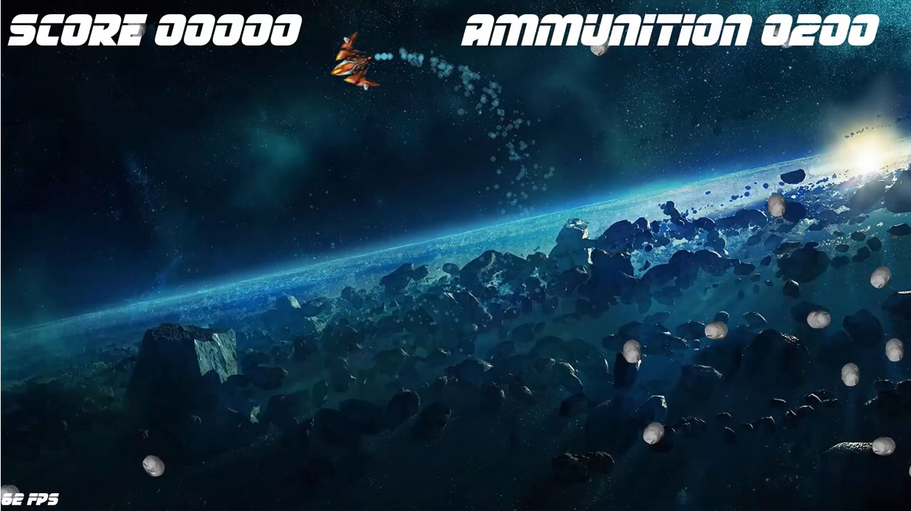

# AsteroidsPy
Asteroids fan game in Python using PyGame

Clic on the screenshots to see the video

- Arrows Left / Right to turn left / right
- Left Ctrl key for engine
- Space bar to fire

- ESC to quit the game
- F to show/hide FPS
- U for undestructible (cheat mode)
- R to reload amunition (cheat mode)
- Arrows Down to stop/resume music

To run this game in windows launch build.cmd
The game exe will be located in the /build directory

To run this game in python, first install the prerequisites
- pygame

The game main file is main.py

